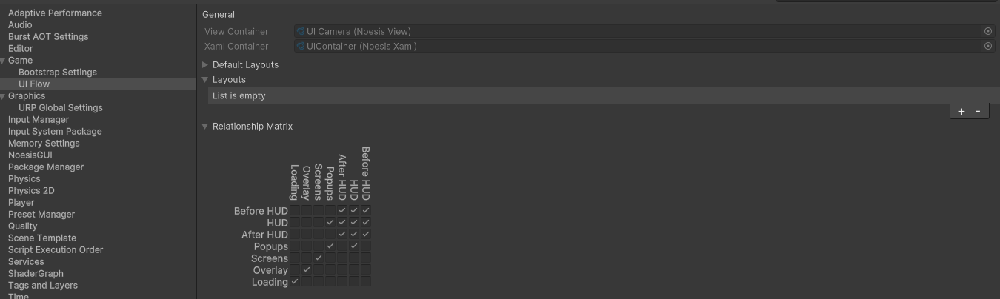
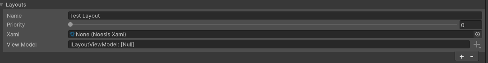
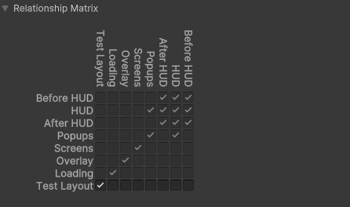

## About
This is small UI framework based on [Noesis GUI Engine](https://www.noesisengine.com/) for Unity.

## Dependencies
- Noesis GUI: 3.2.2

## Usage
#### UI Flow Settings
Open a **Project Settings->Game->UI Flow** to get layouts settings:


#### Layout Settings


- **Name** of layout. This can be got in code by UILayoutId.LayoutToName method.
- **Priority** of layout. This represents layout views order in range from zero (inclusive) to 31 (inclusive). Layouts with higher priority drawn last.
- **Xaml** of layout view. This represents visual layout of UI Layout view.
- **View Model** of layout. This represents UI Layout logic, e.g. a logic of layout child elements composition. 

#### Layout Relationship Matrix
<p align="center">

</p>

Each row in the layout relationship matrix say us how Noesis should draw each layout relatively another, where **true** value say us that this layout should be drawn or not otherwise.

#### Open View
Each view model can be registered only with one View type per Layout.
```c#
var viewModel = new SomeViewModel();
UIFlowUtility.ShowView<SomeViewModel, SomeView>(viewModel, UILayout.HUD);
```

#### Close View
```c#
UIFlowUtility.HideView(this, UILayout.HUD); // where this - some view model
```

#### Register View Type
This allow register (warm-up) only view type without view opening.
```c#
UIFlowUtility.RegisterView<SomeViewModel, SomeView>(UILayout.HUD);
```

#### Unregister View Type
```c#
UIFlowUtility.UnregisterView<SomeView>(UILayout.HUD);
```

#### Custom View Model
Each view model that can be showed in UI Layout should inherit the **BaseLayoutContentViewModel**.
```c#
public sealed class CustomViewModel : BaseLayoutContentViewModel
{
}
```

#### Custom View
Each view that can be showed in UI Layout should inherit the **LayoutContentView**.
```c#
public partial class CustomView : LayoutContentView
{
   public CustomView()
   {
       InitializeComponent();
   }

#if NOESIS
   private void InitializeComponent()
   {
       NoesisUnity.LoadComponent(this);
   }
#endif
}
```

For XAML:
```xaml
<views:LayoutContentView xmlns:views="clr-namespace:UIFlow.Runtime.Layouts.Views" x:Class="CustomView"
                         xmlns="http://schemas.microsoft.com/winfx/2006/xaml/presentation"
                         xmlns:x="http://schemas.microsoft.com/winfx/2006/xaml"
                         xmlns:d="http://schemas.microsoft.com/expression/blend/2008"
                         xmlns:mc="http://schemas.openxmlformats.org/markup-compatibility/2006" mc:Ignorable="d"
                         x:Name="Root" d:DesignWidth="1920" d:DesignHeight="1080">
    <Grid>
    </Grid>
</views:LayoutContentView>
```

#### Custom View Show/Hide Animation
Each view that inherits **LayoutContentView** can has Show and/or Hide animation (storyboard). For this we should determine style for our custom view and set storyboard for ShowStoryboard and/or HideStoryboard dependency properties.
```xaml
<views:LayoutContentView.Style>
   <Style>
       <Style.Resources>
           <Storyboard x:Key="ShowAnimation">
               <DoubleAnimation Storyboard.TargetProperty="Opacity" From="0.0" To="1.0" Duration="0:0:0.3"/>
           </Storyboard>
           <Storyboard x:Key="HideAnimation">
               <DoubleAnimation Storyboard.TargetProperty="Opacity" From="1.0" To="0.0" Duration="0:0:0.3"/>
           </Storyboard>
       </Style.Resources>
       <Setter Property="views:LayoutContentView.ShowStoryboard" Value="{StaticResource ShowAnimation}"/>
       <Setter Property="views:LayoutContentView.HideStoryboard" Value="{StaticResource HideAnimation}"/>
   </Style>
</views:LayoutContentView.Style>
```

#### Custom Layout View Model
Each custom layout view model should inherit **ILayoutViewModel** (or it's implementations - **BaseLayoutViewModel** or **SingleContentLayoutViewModel**) and sets it to Layout settings in **Project Settings**.
```c#
public sealed class CustomLayoutViewModel : SingleContentLayoutViewModel
{
}
```

#### Custom Layout View
A custom layout view can be any User Control.
```c#
public partial class CustomLayoutView : UserControl
{
   public CustomLayoutView()
   {
       InitializeComponent();
   }

#if NOESIS
   private void InitializeComponent()
   {
       NoesisUnity.LoadComponent(this);
   }
#endif
}
```

For XAML:
```xaml
<views:UserControl xmlns:views="clr-namespace:UIFlow.Runtime.Layouts.Views" x:Class="CustomLayoutView"
                         xmlns="http://schemas.microsoft.com/winfx/2006/xaml/presentation"
                         xmlns:x="http://schemas.microsoft.com/winfx/2006/xaml"
                         xmlns:d="http://schemas.microsoft.com/expression/blend/2008"
                         xmlns:mc="http://schemas.openxmlformats.org/markup-compatibility/2006" mc:Ignorable="d"
                         x:Name="Root" d:DesignWidth="1920" d:DesignHeight="1080">
    <Grid>
    </Grid>
</views:UserControl>
```
